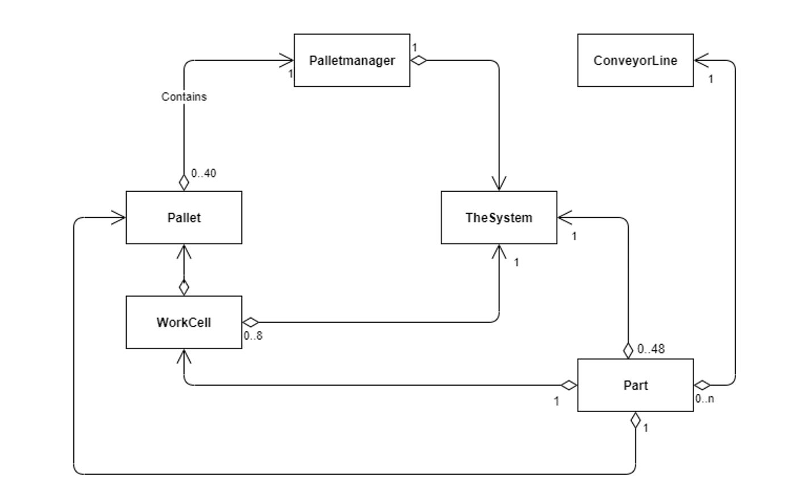

# The System

The program will be simlulating the workflow of a belt-conveyor system that runs on specific set of blocking rules.

Goal is to identify and check bottle-necks and optimize performance.

Following is the class diagram showing interactions amontg the entities.

